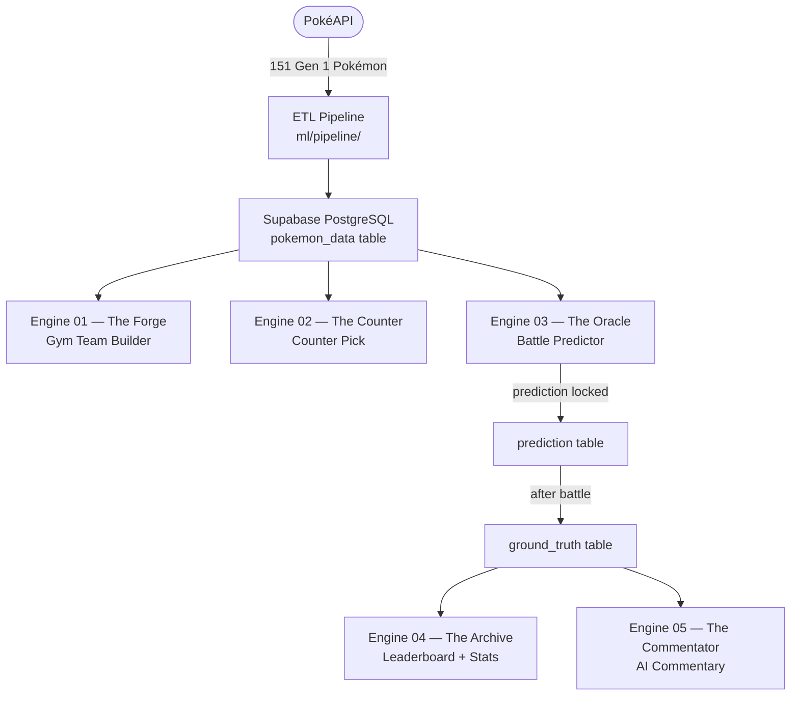

# Pokémon Data Engine — System Guide

> **Version:** 2.0 · **Date:** 2026-05-30
> **Stack:** Next.js 14 · NestJS · Python FastAPI · Supabase PostgreSQL · Anthropic Claude API

---

## Table of Contents

1. [System Overview](#1-system-overview)
2. [Starting the System](#2-starting-the-system)
3. [User Accounts & Trainer Profiles](#3-user-accounts--trainer-profiles)
4. [Engine 01 — The Forge](#4-engine-01--the-forge)
5. [Engine 02 — The Counter](#5-engine-02--the-counter)
6. [Engine 03 — The Oracle](#6-engine-03--the-oracle)
7. [Engine 04 — The Archive](#7-engine-04--the-archive)
8. [Engine 05 — The Commentator](#8-engine-05--the-commentator)
9. [Engine 06 — The Pokedex AI](#9-engine-06--the-pokedex-ai)
10. [Engine 07 — The Exporter](#10-engine-07--the-exporter)
11. [Engine 08 — The Wall](#11-engine-08--the-wall)
12. [Engine 09 — The Scanner](#12-engine-09--the-scanner)
13. [Engine 10 — The Replay](#13-engine-10--the-replay)
14. [Pokémon Showdown Integration](#14-pokémon-showdown-integration)
15. [Dashboard](#15-dashboard)
16. [Battle History & Model Metrics](#16-battle-history--model-metrics)
17. [Pokémon DB & Pool Management](#17-pokémon-db--pool-management)
18. [Database Schema Reference](#18-database-schema-reference)
19. [Known Issues & Notes](#19-known-issues--notes)

---

## 1. System Overview

The Pokémon Data Engine is a 10-engine data mining and machine learning platform built around Gen 1 Pokémon battle data. It combines ML algorithms, AI language models, and live Pokémon Showdown integration into one dashboard.

**Service Architecture:**

```
Browser (Next.js :3000)
        │
        ▼
NestJS API (:3001) ─── Supabase PostgreSQL
        │
        ▼
Python FastAPI (:8000) ─── ml/models/ (.pkl files)
        │
        ▼
Anthropic Claude API (Engines 5 & 6)
Pokémon Showdown API (Engines 7, 10, Replay Sync)
```

**Data Pipeline:**



---

## 2. Starting the System

### Prerequisites
- Node.js 18+, Python 3.10+, pip
- A Supabase project with PostgreSQL
- An Anthropic API key (for Engines 5 & 6)

### Environment Setup

Create `backend/.env`:
```env
PORT=3001
DB_HOST=your-supabase-host.supabase.co
DB_PORT=5432
DB_USER=postgres
DB_PASSWORD=your-password
DB_NAME=postgres
ML_SERVICE_URL=http://localhost:8000
NODE_ENV=development
CORS_ORIGIN=http://localhost:3000
JWT_SECRET=your-secret-key
JWT_EXPIRES_IN=7d
ANTHROPIC_API_KEY=sk-ant-...
```

### Database Seeding (run once)
```bash
cd ml
pip install -r requirements.txt
python pipeline/run_pipeline.py --limit 151
python pipeline/generate_synthetic_battles.py --n-battles 500
```

### Starting Services
```bash
# ML service (port 8000)
cd ml && uvicorn api.main:app --host 0.0.0.0 --port 8000 --reload

# Backend (port 3001)
cd backend && npm run start:dev

# Frontend (port 3000)
cd frontend && npm run dev
```

The backend auto-runs all DB migrations (`ALTER TABLE IF NOT EXISTS`) on startup — safe to restart at any time.

---

## 3. User Accounts & Trainer Profiles

### Registration (2-step)

**Step 1:** Username, password, section

**Step 2 — Trainer Customization:**
- **Trainer Class**: Choose from 35+ trainer sprites (Youngster, Ace Trainer, Brock, Misty, Giovanni, Red, Blue, etc.)
- **Card Color**: 8 color options for your trainer card theme
- **My Pokémon**: Search any Gen 1 Pokémon — choose the one you've been assigned
- **Display Name, Hometown, Trainer Title, Trainer ID**: Cosmetic fields shown on your trainer card

All choices are saved to your account and can be changed any time at `/profile` → EDIT TRAINER.

### Trainer Card

Your trainer card appears:
- On the Dashboard Pokédex right panel
- At `/profile`
- In leaderboard entries (future)

It shows: trainer sprite, Pokémon sprite, display name, ID, title badge, hometown, and battle stats (W/L/Win%).

### Data Isolation

Every user's engine outputs, battle predictions, and assigned Pokémon pool are scoped by `user_id` (UUID). You only ever see your own data. The leaderboard is the only cross-user view.

### JWT Authentication

All engine POST endpoints require a Bearer token (`Authorization: Bearer <token>`). The token is stored in `localStorage` as `pk_auth` and automatically attached to every API request. Tokens expire after 7 days.

---

## 4. Engine 01 — The Forge

**Route:** `/engine1` · **Auth:** Required · **ML:** K-Means clustering

### What it does
Generates a 6-Pokémon Gym Leader team tailored to a chosen type specialty and difficulty. Uses ML clustering to find the best-fitting Pokémon for each role slot.

### How to use
1. Select a **Type Specialty** (Fire, Water, Ghost, Dragon, Balanced, etc.)
2. Choose a **Challenge Rank** (Easy = Boulder Badge, Medium = Thunder Badge, Hard = Volcano Badge)
3. Select your **Region** (Kanto, Johto, Kalos, Alola)
4. Optionally enter a **Gym Leader name**, section, and group name
5. Click **CHOOSE THIS TEAM**

### Output
- 6 Pokémon with role (Ace, Sweeper, Tank, Wall, Support, Balanced)
- Silhouette Score (clustering quality — closer to 1.0 = better)
- AI explanation of the team composition
- **EXPORT FOR SHOWDOWN** → copies team in PS-importable format
- **TAKE THIS TEAM TO BATTLE** → pre-fills Engine 3 with this team

### ML Models Used
| Model | Purpose |
|-------|---------|
| K-Means | Cluster Pokémon by stat profile |
| Decision Tree | Assign role labels |
| Random Forest | Validate team composition |
| Cosine Similarity | Find thematically similar picks |
| Gower's Distance | Mixed-type distance for diverse stats |

### Notes
- Legendaries and Mythicals are excluded from all pools
- Region filter restricts the pool to Pokémon native to that region
- The generated team is saved to `engine_output` and used by Engine 07's export

---

## 5. Engine 02 — The Counter

**Route:** `/engine2` · **Auth:** Required · **ML:** Type Advantage Score + K-NN + DT

### What it does
Given an opponent's Gym Leader team, recommends the best counter team from your assigned Pokémon pool.

### How to use
1. Enter up to 4 of the **opponent's Pokémon** (use the autocomplete search)
2. Optionally: click **IMPORT FROM SHOWDOWN** to paste a PS team text directly
3. Select your **region** if applicable
4. Click **COUNTER**

### Pool Priority
1. If you have personally assigned Pokémon (`/pokemon/my-pool` with `user_assigned: true`) → uses those
2. If no personal pool → falls back to globally assigned Pokémon (`is_assigned = 1`)

### Output
- 6 recommended counter Pokémon with counter scores and score breakdowns
- Type matchup table showing advantage/disadvantage against each opponent Pokémon
- Counter Success Rate metric

### Also: `counter-from-data` endpoint
A stateless version (`POST /api/engine2/counter-from-data`) accepts raw Pokémon stat objects without DB lookups — useful for external integrations.

### Metric: Counter Success Rate
Tracked in `engine_output`. When a counter team is used and the battle result is recorded in Engine 03, the system calculates whether the counter recommendation was successful.

---

## 6. Engine 03 — The Oracle

**Route:** `/engine3` · **Auth:** Required · **ML:** 5-model ensemble

### What it does
Predicts the winner of a Pokémon battle BEFORE it happens. After the battle, records the actual result and updates the model's accuracy metrics.

### IMPORTANT: Order of operations
```
1. BOTH trainers agree on team compositions
2. ONE trainer opens Engine 3 and submits the prediction
   (prediction is LOCKED immediately — cannot be edited)
3. Battle is played on Pokémon Showdown
4. EITHER trainer records the actual result in Engine 3
5. System computes correct_prediction and updates metrics
```

### How to use
**Before battle:**
1. Enter a unique **Match ID** (e.g. `match_jardo_vs_tone_01`)
2. Enter **Trainer A name** and their 4 Pokémon
3. Enter **Trainer B name** and their 4 Pokémon
4. Click **PREDICT** → prediction is locked

**After battle:**
1. Find the match in the history section or re-enter the Match ID
2. Select the **actual winner**
3. Optionally add: replay link, screenshot link, final score
4. Click **RECORD RESULT**

### Output
- Predicted winner with confidence score (%)
- Per-model votes (5 models)
- Prediction reason
- After result: CORRECT ★ or WRONG ✗ badge

### ML Models
| Model | Role |
|-------|------|
| Decision Tree | Rule-based splits on stat ratios |
| Random Forest | Ensemble of stat-based trees |
| Logistic Regression | Linear boundary on feature space |
| Naïve Bayes | Probabilistic type/role matching |
| K-Nearest Neighbors | Similarity to past battles |

Final prediction = majority vote across all 5 models.

### Metrics tracked
Accuracy · Precision · Recall · F1 · Brier Score · Log Loss · Confusion Matrix (TP/FP/TN/FN)

---

## 7. Engine 04 — The Archive

**Route:** `/archive` (also on Dashboard) · **Auth:** None (public)

### What it does
Live leaderboard ranking all trainers by battle performance, plus global system statistics.

### Leaderboard columns
| Column | Definition |
|--------|-----------|
| Rank | Sorted by win rate DESC, then total wins DESC |
| Trainer | Battler name from the prediction |
| W / L | Wins and losses from recorded ground truths |
| Win% | wins / (battles with results) × 100 |
| Avg Confidence | Mean confidence score across all battles |

### Global Stats panel
- Total battles recorded
- Most-used Pokémon (appears most across all team compositions)
- Most accurate model
- Overall system accuracy

### Dashboard integration
The leaderboard is embedded directly in the Pokédex card on the dashboard. It auto-loads when the page opens.

---

## 8. Engine 05 — The Commentator

**Route:** `/engine5` · **Auth:** Required · **AI:** Anthropic Claude claude-sonnet-4-6

### What it does
Generates dramatic post-battle AI commentary in the style of the Pokémon anime for any completed battle.

### How to use
1. The page lists your recent completed battles (battles with a recorded result)
2. Select a battle
3. Click **GENERATE COMMENTARY**
4. Wait ~3-5 seconds for Claude to generate 3 paragraphs of commentary

### What Claude receives
- Team A trainer name + Pokémon team
- Team B trainer name + Pokémon team
- Predicted winner + confidence %
- Actual winner
- Whether the prediction was correct

### Output
3-paragraph narrative commentary mentioning specific Pokémon names, type advantages, and why the winner succeeded. If the prediction was wrong, Claude acknowledges the upset dramatically.

### Requires
`ANTHROPIC_API_KEY` set in `backend/.env`

---

## 9. Engine 06 — The Pokedex AI

**Route:** `/engine6` · **Auth:** None · **AI:** Anthropic Claude + keyword RAG

### What it does
A chat interface with Professor Oak that answers questions about Gen 1 Pokémon using structured data from the database.

### How to use
1. Type a question in the input box or click a suggestion
2. Press Enter or click SEND
3. Professor Oak responds using Pokémon data as context

### Example questions
- "Who is the best sweeper?"
- "Which Pokémon counters Psychic types?"
- "Build me a balanced team"
- "What are the fastest Pokémon?"
- "Compare Gengar and Alakazam"

### How it works (RAG approach)
1. User submits a question
2. System loads all 151 Pokémon rows from the DB
3. Keyword filtering selects the 10 most relevant Pokémon based on name/type/role matches in the question
4. Top 10 Pokémon stats are formatted as structured context
5. Sent to Claude with a Professor Oak persona prompt
6. Response includes the sources (Pokémon used as context)

### Requires
`ANTHROPIC_API_KEY` set in `backend/.env`

---

## 10. Engine 07 — The Exporter

**Route:** `/engine7` · **Auth:** Required

### What it does
A standalone import/export utility for Pokémon Showdown team formats.

### Import panel
1. Paste any Pokémon Showdown team text (copy from PS teambuilder → Import/Export)
2. Click **IMPORT TEAM**
3. System parses the PS format and matches Pokémon names to the database
4. Shows **Found** (green pills) and **Not Found** (red pills)
5. Click **USE THIS TEAM** to send the found Pokémon to Engine 02

### Export panel
1. Select up to 4 Pokémon from your pool using the chip selector
2. Click **COPY TO CLIPBOARD**
3. Paste into PS teambuilder → Import/Export

### PS Format
The system generates proper Gen 1 PS-importable format:
```
Gengar
- Body Slam
- Earthquake
- Ice Beam
- Thunderbolt

Starmie
- Rest
- Toxic
- Thunder Wave
- Body Slam
```
Moves are assigned by role (sweeper/tank/wall/support/balanced).

---

## 11. Engine 08 — The Wall

**Route:** `/wall` · **Auth:** None (public display)

### What it does
A fullscreen live leaderboard designed for classroom/projector display. No navigation bar, no login required.

### Features
- Polls `GET /api/archive/leaderboard` every **10 seconds**
- Large-format trainer names and W/L/Win% display
- Rank badge colors: Gold (#1), Silver (#2), Bronze (#3)
- Win rate color-coding: Gold = 100%, Green = ≥50%, Red = <50%
- "LIVE" pulsing indicator

### To use
Open `http://localhost:3000/wall` on a projector browser. The page auto-refreshes with new results. No interaction needed.

---

## 12. Engine 09 — The Scanner

**Route:** `/engine9` · **Auth:** Required

### What it does
Analyses a team of up to 4 Pokémon and produces a type weakness profile with an SVG radar chart across all 18 types.

### How to use
1. Type Pokémon names in the 6 input fields (autocomplete supported)
2. Click **SCAN TEAM**

### Output
- **SVG Radar Chart**: 18-axis chart where each axis = one type
  - Red spike = weakness (avg multiplier ≥ 1.5×)
  - Green = resistance (avg multiplier ≤ 0.5×)
  - Gray = neutral
- **Coverage Audit panel**:
  - Types your team is weak to
  - Types your team resists
  - Uncovered offensive types
  - Recommended types to add for better coverage

### How it calculates
For each type, the system averages the `def_vs_{type}` multiplier across all 4 Pokémon. Values above 1.5 = critical weakness, below 0.75 = strong resistance.

---

## 13. Engine 10 — The Replay

**Route:** `/engine10` · **Auth:** Required

### What it does
Parses a Pokémon Showdown battle replay into a structured turn-by-turn timeline viewer.

### How to use
1. After a battle on Pokémon Showdown, copy the replay URL or ID (e.g. `gen1ou-12345` or the full URL)
2. Paste it into the input field on Engine 10
3. Click **LOAD REPLAY**

### Output
Turn-by-turn event log grouped by turn number:
- **MOVE** events: which Pokémon used which move
- **DAMAGE** events: HP changes
- **SWITCH** events: Pokémon switches
- **HEAL** events: recovery
- **FAINT** events: knockouts
- **WIN** highlight: winner announcement

### Replay Sync
Separately, you can sync the latest Gen 1 OU replays from PS automatically:
```
POST /api/replay/sync
GET  /api/replay/recent
```
Synced replays are stored in the `showdown_replay` table.

---

## 14. Pokémon Showdown Integration

The system integrates with Pokémon Showdown at multiple points:

### Team Export (Engine 01 + 07)
- Engine 01 results: "EXPORT FOR SHOWDOWN" copies PS-format team text to clipboard
- "Open in Showdown ↗": copies team + opens PS teambuilder in new tab
- In PS: click **Import/Export → paste** to load the team

### Team Import (Engine 02 + 07)
- Engine 02: "IMPORT FROM SHOWDOWN" button opens a paste modal
- Engine 07: Dedicated import panel

### PS Format Supported
```
Pikachu
- Move 1
- Move 2
- Move 3
- Move 4

Starmie
- Move 1
...
```
Handles: `Name @ Item`, `Name (Nickname)`, move lines (`- Move`), blank lines, `=== headers ===`

### Why PS cannot be embedded
PS sets `X-Frame-Options: SAMEORIGIN` — iframing from another domain is blocked by the browser. The clipboard + paste approach is the correct workflow.

---

## 15. Dashboard

**Route:** `/` · **Auth:** Optional (data is scoped to logged-in user)

### Pokédex Card (left)
- **BATTLE LEADERBOARD**: Live top-8 trainer rankings from Engine 04
- Right panel: Trainer name/ID/title, last generated team grid (6 sprites), LAUNCH BATTLE button, COPY TEAM button, trainer rank stars

### Battle Station (right)
- 3D Pokéball
- Quick navigation: Gym Team Builder, Counter Pick, Battle Predict

### Trainer Status cards
| Card | Source | Logged out |
|------|--------|-----------|
| TOTAL POKÉMON | All Pokémon in DB | Shows (411) |
| ASSIGNED POOL | User's `user_assigned` count | Shows `—` |
| TOTAL BATTLES | User's recorded battles | Shows `—` |
| ACCURACY | User's prediction accuracy | Shows `—` |

### Recent Battle Log
Last 5 of the logged-in user's battle predictions. Shows PENDING → CORRECT/WRONG after result is recorded.

---

## 16. Battle History & Model Metrics

### `/history`
Full paginated list of all the user's battle predictions with results, confidence scores, and timestamps.

Status badges:
- **PENDING**: Prediction made, no result recorded yet
- **★ CORRECT**: Predicted winner matched actual winner
- **✗ WRONG**: Prediction was incorrect

### `/metrics`
Model performance dashboard showing:
- Per-model accuracy comparison
- Confusion matrix (TP/FP/TN/FN)
- Accuracy, Precision, Recall, F1, Brier Score, Log Loss
- Total battles and correct predictions

---

## 17. Pokémon DB & Pool Management

### `/pokemon`
Browse all 151 Gen 1 Pokémon with stats, types, roles, and assigned status. Filter by type, role, or region.

### Personal Pool (`/pokemon/my-pool`)
Each user has a personal Pokémon pool stored in `user_pokemon_assignment`. To assign Pokémon:
1. Go to `/pokemon`
2. Toggle the POOL column for any Pokémon
3. Assigned Pokémon appear with a yellow star

Your personal pool is used by **Engine 02** as the counter team source. If empty, Engine 02 falls back to the global assigned pool.

### Assigned Pokémon CSV
When your assigned Pokémon CSV is provided:
```bash
# Place CSV at:
ml/data/csv/assigned_pokemon.csv

# Re-run pipeline to seed global is_assigned flags:
cd ml && python pipeline/run_pipeline.py --limit 151
```

---

## 18. Database Schema Reference

### `users`
```sql
id               UUID PRIMARY KEY DEFAULT gen_random_uuid()
username         TEXT UNIQUE NOT NULL
password_hash    TEXT NOT NULL
display_name     TEXT
section          TEXT DEFAULT '3ISC'
trainer_class    TEXT DEFAULT 'youngster'
trainer_card_color TEXT DEFAULT 'red'
starter_pokemon  TEXT DEFAULT 'charmander'
hometown         TEXT DEFAULT 'Pallet Town'
favorite_type    TEXT DEFAULT 'Normal'
trainer_title    TEXT DEFAULT 'Trainer'
rival_name       TEXT DEFAULT ''
trainer_id       TEXT DEFAULT ''
created_at       TIMESTAMPTZ DEFAULT NOW()
```

### `pokemon_data`
151 rows. Key columns: `pokemon_id, pokeapi_id, name, type_1, type_2, hp, attack, defense, special_attack, special_defense, speed, total_base_stats, role_label, speed_tier, weakness_count, resistance_count, def_vs_[18 types], native_region, generation, restricted_status, is_assigned`

### `user_pokemon_assignment`
```sql
user_id    UUID FK → users.id ON DELETE CASCADE
pokemon_id INT FK → pokemon_data.pokemon_id
assigned_at TIMESTAMPTZ DEFAULT NOW()
PRIMARY KEY (user_id, pokemon_id)
```

### `engine_output`
Logs every Engine 1/2 run: `engine_type, model_used, input_data, generated_output, region, type_specialization, gym_leader, section, group_name, user_id, timestamp`

### `prediction`
Locked pre-battle records: `match_id, battler_a, battler_b, predicted_winner, confidence_score, prediction_reason, model_used, team_a (JSON), team_b (JSON), is_locked, user_id, timestamp`

### `ground_truth`
Post-battle actuals: `match_id, actual_winner, correct_prediction (0/1), replay_link, screenshot_link, final_score, num_turns, mvp_pokemon, timestamp`

### `audit_log`
Every write operation: `user_or_group, action_done, affected_table, affected_record, old_value, new_value, user_id, timestamp`

### `showdown_replay`
Synced PS replays: `replay_id TEXT PK, format, p1, p2, winner, upload_time, synced_at`

---

## 19. Known Issues & Notes

### ML metric fix (Engine 3)
The `get_metrics()` function in `ml/engines/engine3_battle_predictor.py` compares the CSV `winner` column as string `"A"` but the data stores integers `0/1`. If accuracy shows 0%, apply this fix:
```python
# In get_metrics(), change:
df['correct'] = df['winner'] == 'A'
# To:
df['correct'] = df['winner'].astype(str) == df['predicted'].astype(str)
```

### Supabase free tier
The Supabase free tier pauses projects after ~1 week of inactivity. If the backend shows `ENOTFOUND`, go to [supabase.com/dashboard](https://supabase.com/dashboard), find the project, and click **Restore project**.

### Stale localStorage sessions
JWT tokens are stored in `localStorage`. If a user's token expires, the dashboard auto-clears it on the next 401 response. Manual clear: DevTools → Application → Local Storage → delete `pk_auth`.

### PS replay embedding
Pokemon Showdown cannot be embedded via iframe due to `X-Frame-Options: SAMEORIGIN`. The correct workflow is copy team → open PS → Import from text or URL → paste.
